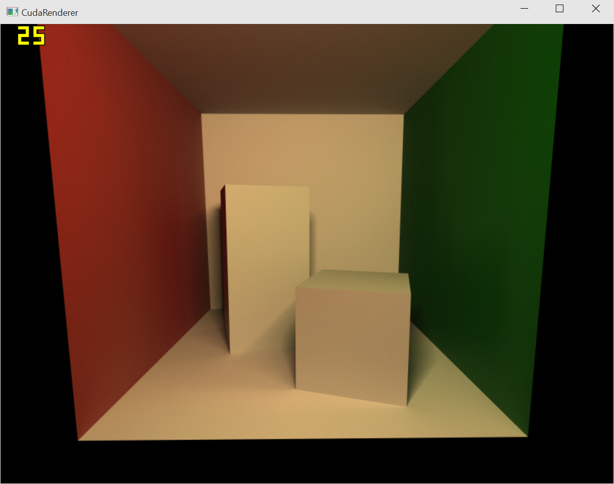
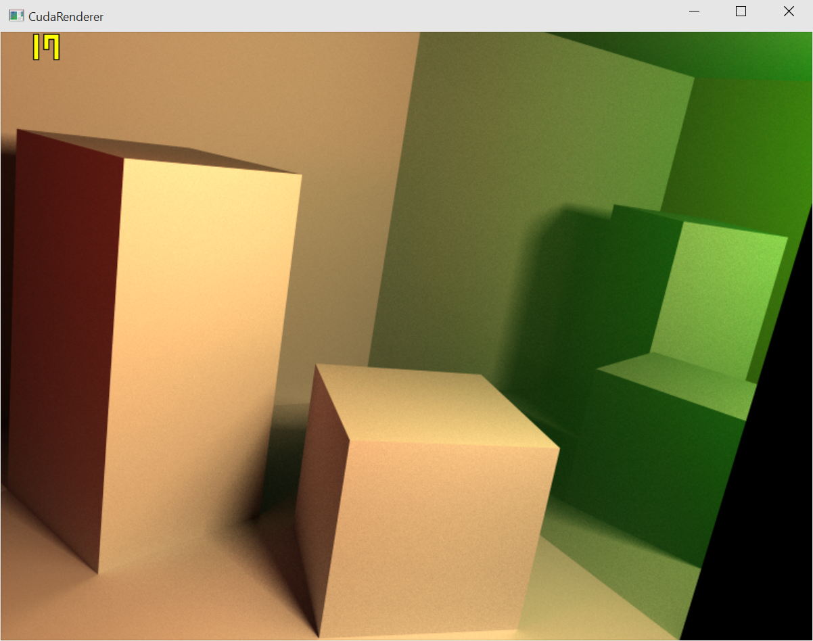
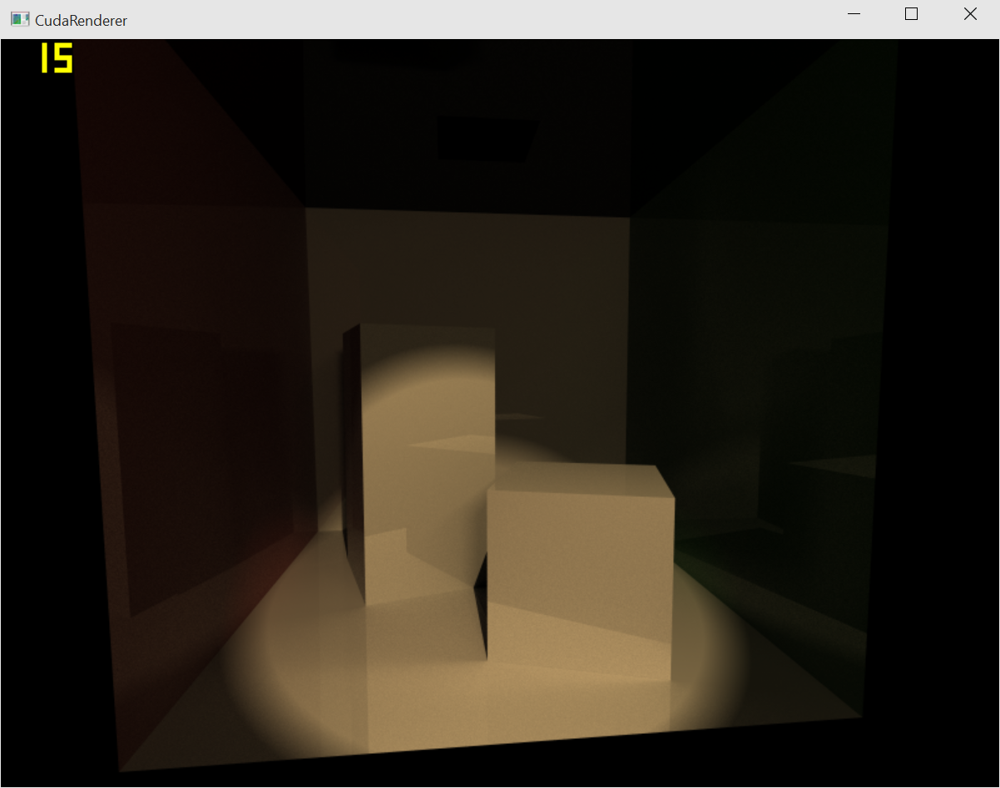
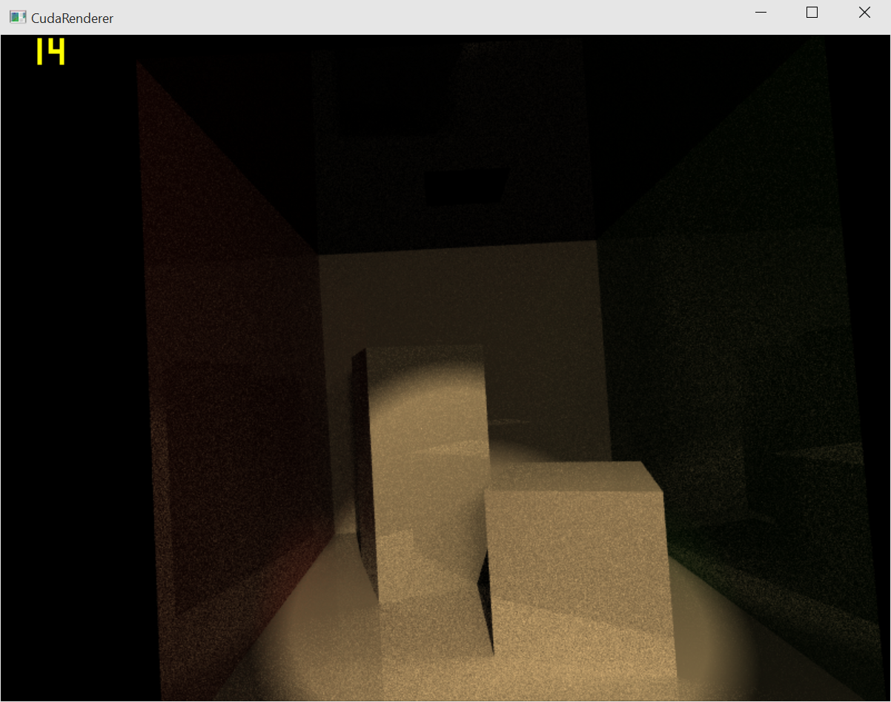
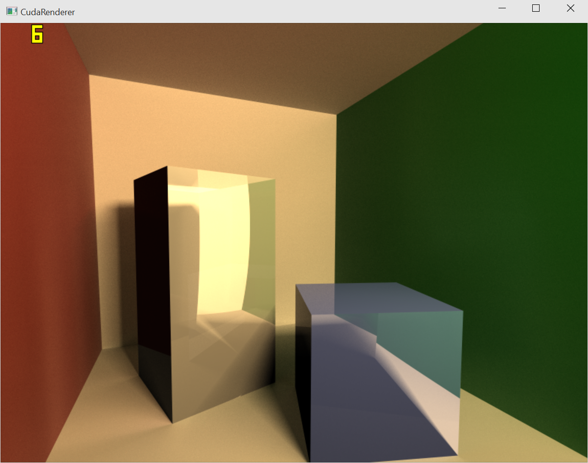

# Overview
A real-time GPU raytracer created using CUDA and adaptive thread-block allocation and assignment of rays.

### Get excited for:
* Bounding interval hierarchies to amortize the cost of intersections from linear to logarithmic time
* Adaptive GPU thread-block assignment of rays

# VIEW OUR FINAL REPORT
<a href="report.html">Final Report</a>

# Sneak Peek - Cornell Box Renders

Here is a sneak peak of a few different scenes our real-time raytracer has rendered.  We went through the pain of connecting a 3D import asset library to our project to give us complete control over the scenes that we render, making it very easy for us to test and debug our project.  We're excited to implement data structures that significantly improve the ray intersection part of our program and then put our real-time raytracer to the test with even more complex scenes.

#### Diffuse Scene

#### Specular Scene

#### Specular Scene with Spotlight

#### Scene Converging

#### Transparent Scene

#### Video Preview (Real-time)
<video width="100%" style="padding:5px;" controls>
  <source src="videos/sneak.mp4" type="video/mp4">
Your browser does not support the video tag.
</video>

# Final Steps

* Finish up final visual features of raytracer.
* Optimize data structures to organize mesh objects locationally to minimize the amount of computation needed to perform intersections.
* Gather and analyze framerates for different scenes and different optimizations.